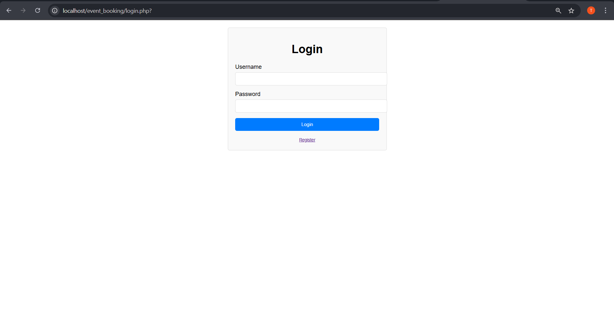
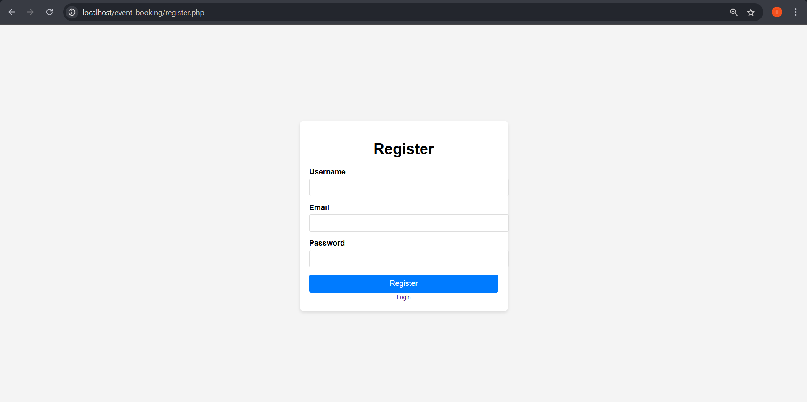
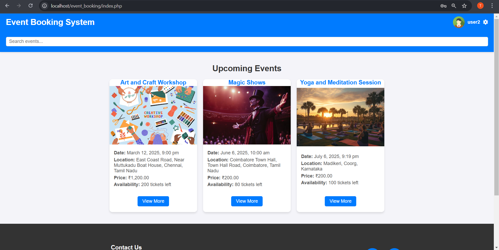
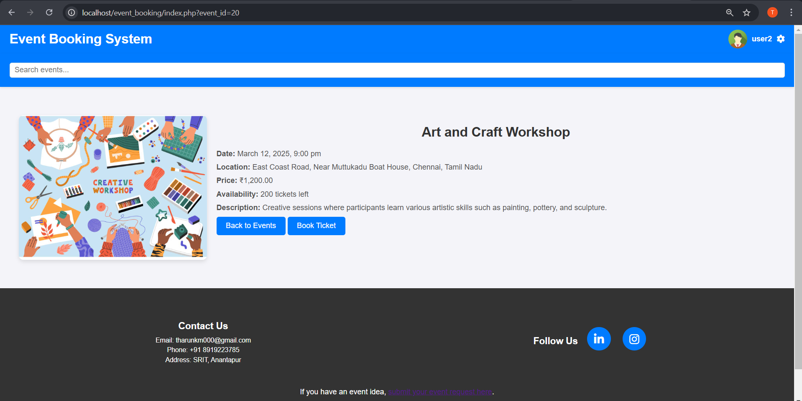
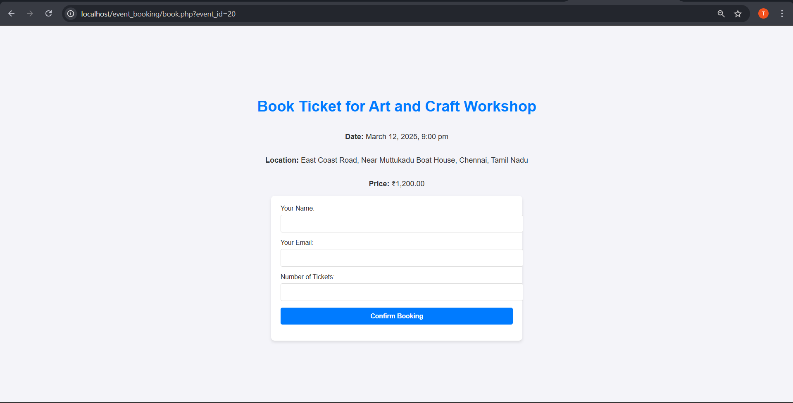
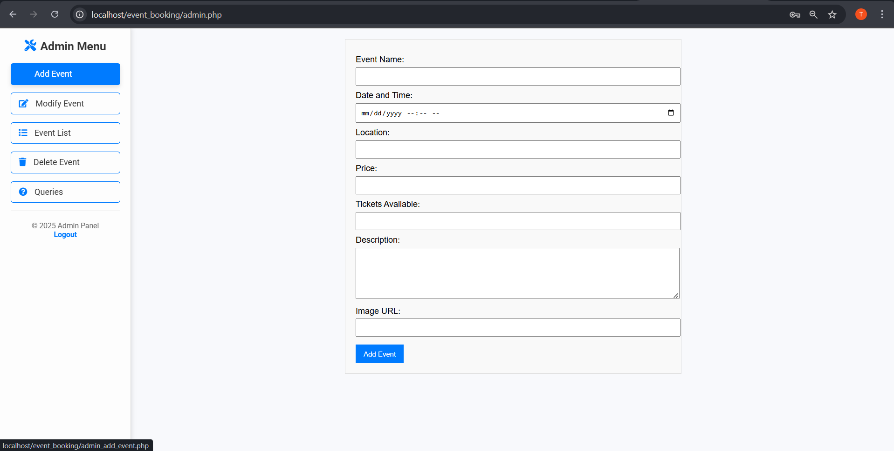
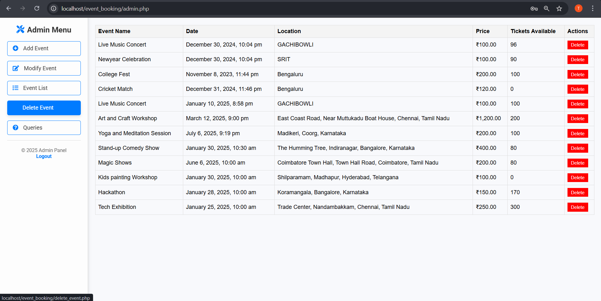
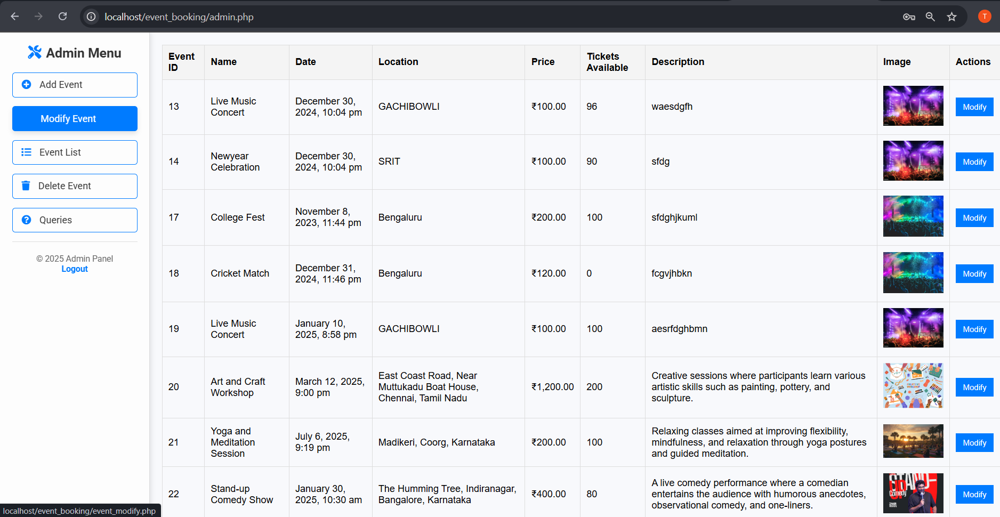
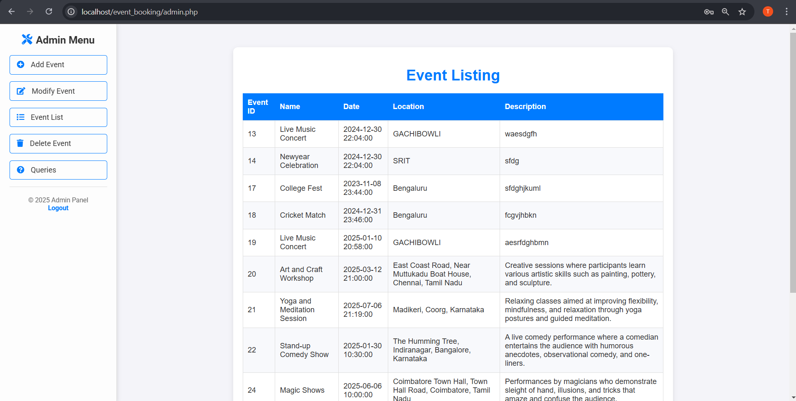
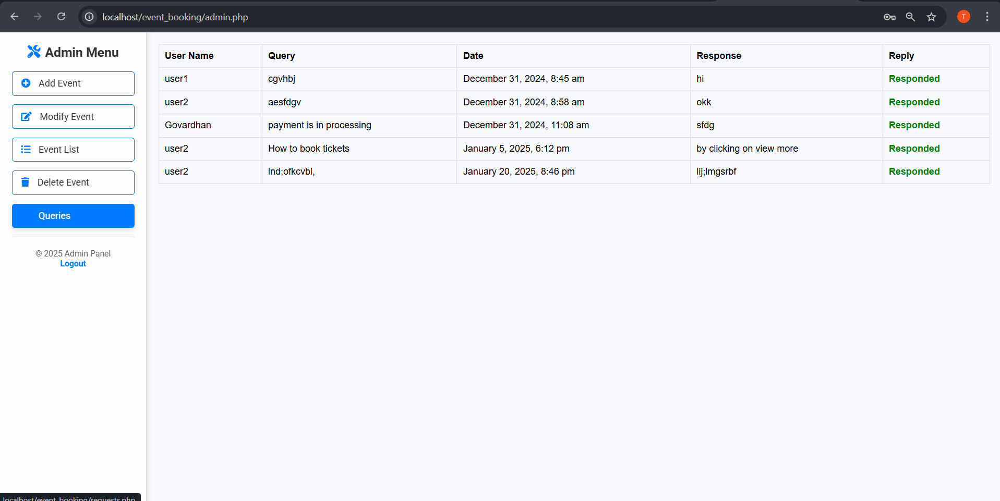

#  Event Management System  

##  Overview  

The **Event Management System** is a user-friendly web application that simplifies event organization and participation. It allows users to browse, register, and book events while providing an intuitive admin panel to manage events, users, and inquiries efficiently.  

This platform is perfect for **corporate events, concerts, weddings, workshops, and community gatherings**, offering seamless event planning and booking.  

---

##  Features  

###  **User Functionalities**  
 **User Authentication** – Register/Login securely to access events.  
 **Browse Events** – View upcoming and past events with detailed information.  
 **Event Booking** – Reserve spots for events with a simple booking system.  
 **Profile Management** – Update user details and track event bookings.  
 **Query Submission** – Contact admins with event-related questions.  

###  **Admin Functionalities**  
 **Event Management** – Add, delete, and modify events dynamically.  
 **Booking Management** – View and manage user registrations.  
 **User Queries** – Respond to user questions and resolve issues.  

---

##  Screenshots  

### 1 **User Login Page**  

### 2 **User Registration Page**  

### 3 **Index (Home) Page**  

### 4 **View More Event Details**  

### 5 **Event Booking Page**  

### 6 **My Bookings Page**  

### 7 **Admin: Add Event Page**  

### 8 **Admin: Delete Event Page**  

### 9 **Admin: Modify Event Page**  

### 10 **Admin: Event Listings**  

### 10 **Admin: User Queries Management**  

---

##  Future Enhancements  

🔹 **Payment Integration** – Add online payments for event bookings.  
🔹 **Multi-role Access** – Expand access levels (e.g., event organizers).  
🔹 **Event Reviews & Ratings** – Allow users to review past events.  
🔹 **Notification System** – Email/SMS alerts for bookings and updates.  

---

##  License  
This project is licensed under the [MIT License](LICENSE).  

---

###  Contact  
For inquiries or support, reach out to **tharunkm089@gmail.com**  

---
